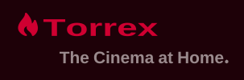
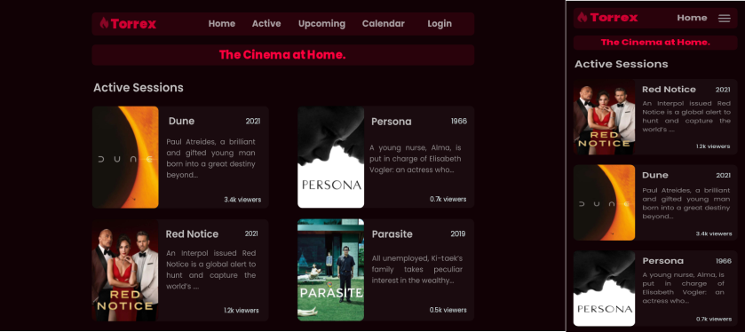
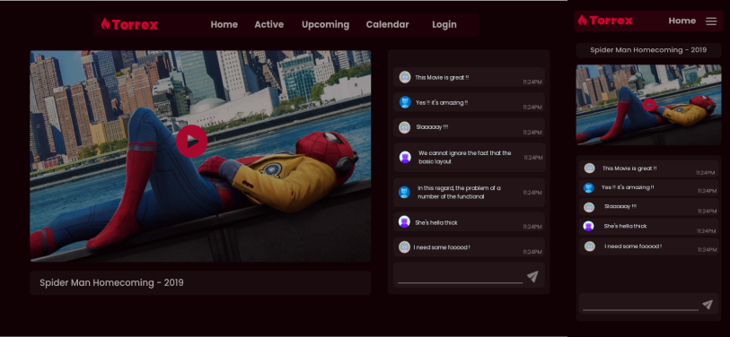

# Torrex

## Stream your Torrents using HLS (HTTP Live Streaming)

### Description

Torrex is a standalone application written in Go, that aims to live stream torrent movies,
tv shows in your network using LL-HLS (Low Latency HTTP Live Streaming).
It has a builtin Web UI built using Solid, written in TypeScript

### Features

    - Easy to use: Just enter the movie name and the app does the rest :)
    - Built-in MPEG-4 Decoder/Encoder
    - Torrent Client
    - Torrent Scraper (Only the best results)
    - HLS Live Stream Module
    - Chat Rooms
    - Movie Sessions
    - Built-in beautiful UI
    - Admin Dashboard (Coming soon in the next Update)
    - Self-Hosted (Dockerfile coming soon)
    - Responsive Design

### Showcase

